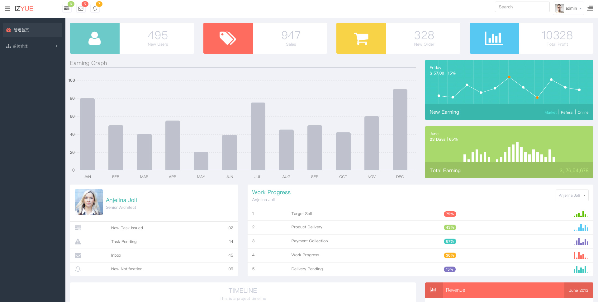

## Yii2.0 基于RBAC的后台管理系统（附演示图片）

[](https://packagist.org/packages/izyue/yii2-app-advanced)
[](https://packagist.org/packages/izyue/yii2-app-advanced)
[](https://packagist.org/packages/izyue/yii2-app-advanced)
[](https://packagist.org/packages/izyue/yii2-app-advanced)

### 简介

系统基于yii2.0框架开发，保留框架原有的特性，适合作为二次开发的基础系统，也可以直接拿来作为后台系统。管理系统的模块在不断完善中，现有的功能包含，完整的RBAC权限管理~

### 功能

1. 基础功能：登录，登出，密码修改等常见的功能

2. 菜单配置：可视化配置菜单，可以根据配置用户的权限显示隐藏菜单

3. 权限机制：角色、权限增删改查，以及给用户赋予角色权限

4. 规则机制：除了权限角色之外有规则机制，即可以给对应的权限配置规则

5. 二次开发：完全可以基于该系统做二次开发，开发一套适合自己的后台管理系统，节约权限控制以及部分基础功能开发的时间成本，后台系统开发的不二之选

6. 持续更新：新的功能模块会持续更新，请关注

### 源码

[https://github.com/liulipeng/yii2-app-advanced](https://github.com/liulipeng/yii2-app-advanced)


###安装

#### 1. 安装/izyue/Yii2模板
---

```
php composer.phar global require "fxp/composer-asset-plugin:~1.1.1"
php composer.phar create-project --prefer-dist izyue/yii2-app-advanced advanced
```
如果composer是全局命令，请执行下面代码

```
composer global require "fxp/composer-asset-plugin:~1.1.1"
composer create-project --prefer-dist izyue/yii2-app-advanced advanced

```

#### 2. 安装Composer
---

```
composer install
```

#### 3. 初始化
---

```
php init
```

#### 4. 导入表结构(migration)
---

需要顺序执行

- 导入rbac migration

```
php yii migrate --migrationPath=@yii/rbac/migrations
```
- 导入admin migration

```
php yii migrate --migrationPath=@izyue/admin/migrations
```

### 后台登录密码
---

```
User: admin
Password: @newsnow.com.cn@
```

### 预览

#### 登录


#### 首页



#### 权限管理


#### 角色管理


#### 路由管理


#### 菜单管理

